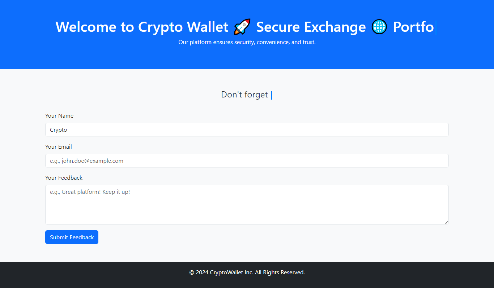

# Crypto Wallet Landing Page with Typed.js Effects

## 🚀 What is this project about?
This project is a **landing page** for a **crypto wallet** that shows animated text effects using **Typed.js**.


## 🎮 How does it work?
We use **Typed.js**, a JavaScript library that makes text appear as if it’s being typed live! It also allows text to delete and rewrite itself automatically.

This project includes **three examples**:
1. **index.html + index.js** → Main crypto wallet landing page with animated text.
2. **example-2.html + example-2.js** → Advanced examples like bulk typing, fading effects, and dynamic placeholders.
3. **example-3.html + example-3.js** → More animations, smart cursors, and delayed typing effects.


### Bulk Typing

```// 1. Bulk Typing: Welcome Message
new Typed("#bulk-typed", {
// Example-1:
//   strings: ["Crypto Wallet 🚀", "Secure Exchange 🌐", "Portfolio Manager 📈"],
// Example-2:
  strings: ['Crypto Wallet 🚀^1000\n Secure Exchange 🌐 ^1000\n Portfolio Manager 📈'],
//   Example-3:
// strings: ['npm install^1000\n `installing components...`^1000\n`Fetching from source...`'],
typeSpeed: 100,
backSpeed: 30,
loop: true,
smartBackspace: false, // Keeps all strings, no skipping. default true
});
```

### FadeOut Typing

```// 2. FadeOut Effect: Instructions
new Typed("#instruction-typed", {
strings: [
"Enter your name below.",
"Don't forget your email!",
"Share your feedback with us.",
],
typeSpeed: 50,
backSpeed: 40,
fadeOut: true, // Fades out the text after typing.
loop: true,
});
```

### Typing in Input Field

```// 3. Typing in Input Field: Dynamic Placeholder
const nameInput = new Typed("#name", {
strings: ["John Doe", "Jane Smith", "CryptoFan123"],
typeSpeed: 50,
backSpeed: 40,
loop: true,
shuffle: true, // Shuffles the order of strings.
});
```




## 🔧 How to run this project?
1. **Download or clone** this repository:
   ```sh
   git clone https://github.com/osamaaslam86004/typedjs.git

   cd typedjs
   ```
2. Open the project folder and double-click **index.html** to see the landing page in your browser.
3. If you want to explore more, open **example-2.html** and **example-3.html**.

## 📌 Key Features
✅ Uses **Typed.js** for awesome typing animations 🎉  
✅ Built with **HTML, CSS, Bootstrap, and JavaScript**  

## 📩 Want to learn more?
Check out **Typed.js** here: [https://github.com/mattboldt/typed.js](https://github.com/mattboldt/typed.js)  

Enjoy the project! 🚀


